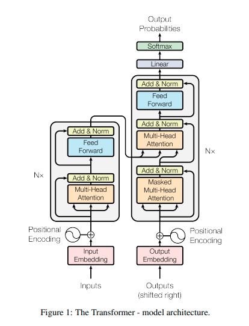
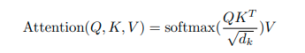
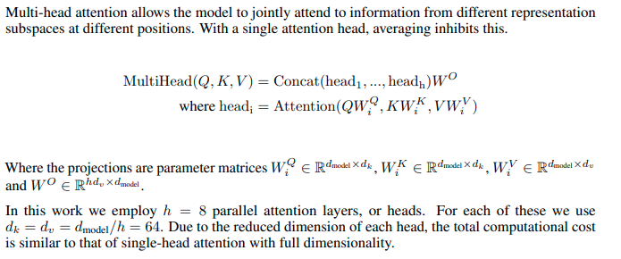
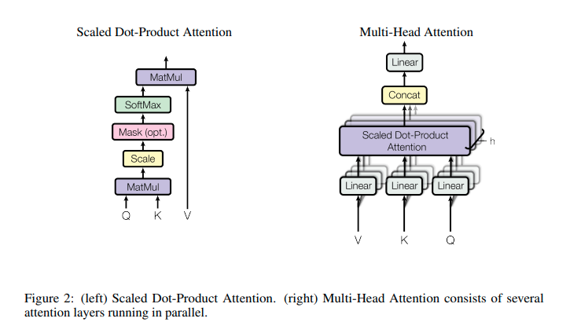
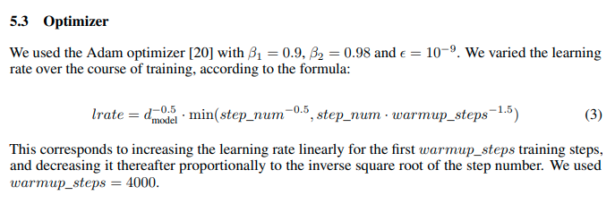
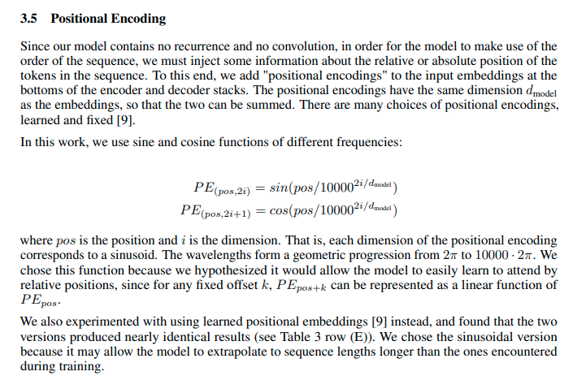
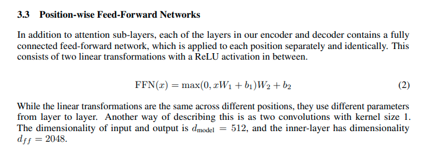

This contains code and reading material related to Attention is all you need. Which introduces concept of Attention and transformers architecture.

- Dictionary, to convert text to number
- Positional embedding
- attention layers
- multihead attention layers

